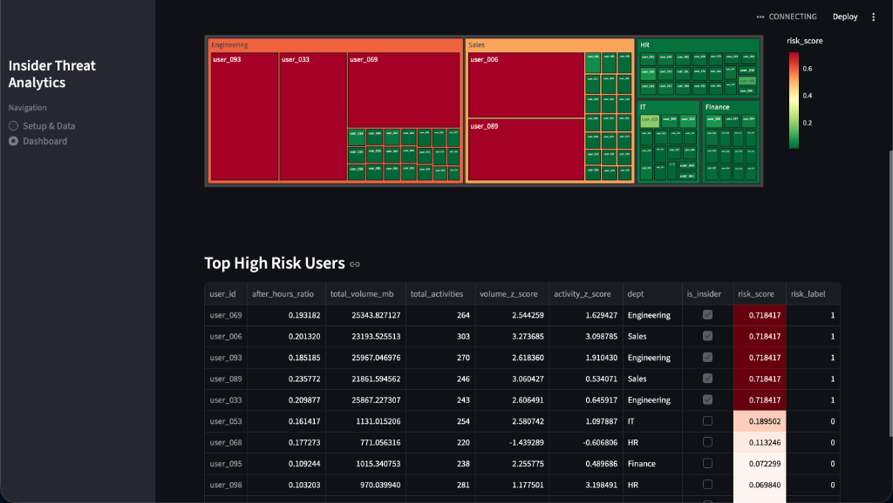

# Enterprise Risk Management


A comprehensive, AI-powered application designed to detect and manage insider threats and enterprise risks using advanced analytics.



## Features

*   **Bring Your Own Data (BYOD):** Seamlessly upload your own organization's activity logs (CSV) or generate synthetic data for demonstration and testing purposes.
*   **Advanced Risk Analytics:** Utilizes a hybrid AI model combining Isolation Forest and XGBoost to detect anomalies and predict potential risks with high accuracy.
*   **Interactive Dashboard:** A powerful, user-friendly dashboard to visualize risk scores, identify high-risk users, and investigate detailed activity timelines.
*   **Explainable AI (XAI):** Provides transparent insights into *why* a specific user or activity was flagged, using SHAP values to explain model decisions.

## Getting Started

The easiest way to run the application is using the provided one-click script.

### 1. Prerequisites

*   **Python 3:** Ensure Python 3 is installed on your system.

### 2. Running the Application

You can start the application in one of two ways:

#### Option A: One-Click Launch (Recommended)
Simply double-click the `run_app.command` file in the project directory. This script will automatically:
1.  Create a virtual environment.
2.  Install all necessary dependencies.
3.  Launch the application in your default web browser.

#### Option B: Terminal
Open your terminal, navigate to the project directory, and run:

```bash
./run_app.command
```

### 3. Using the App

1.  **Setup & Data:**
    *   **Upload CSV:** Select this option to analyze your own dataset.
        *   *Format Requirement:* The CSV file must contain `timestamp`, `user_id`, `activity_type`, and `volume_mb` columns.
    *   **Generate Synthetic Data:** Select this option to generate a sample dataset for testing the application.
2.  **Analyze:** Click the **"Process & Analyze"** button. The AI engine will process the data, engineer features, and train the models.
3.  **Dashboard:** Once the analysis is complete, navigate to the **"Dashboard"** tab to view comprehensive risk insights and visualizations.

## Project Structure

*   `run_app.command`: The automated launcher script.
*   `app.py`: The main Streamlit application interface.
*   `model_engine.py`: The core AI engine for feature engineering, training, and prediction.
*   `data_gen.py`: Utility for generating synthetic test data.
*   `requirements.txt`: List of Python dependencies.
